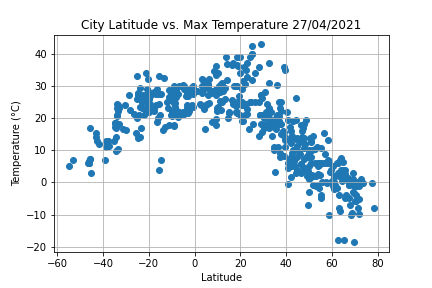
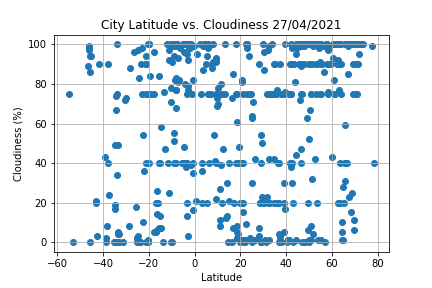
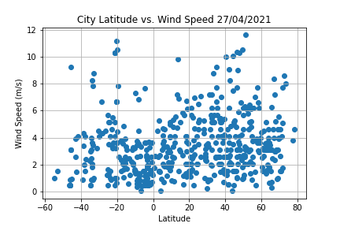
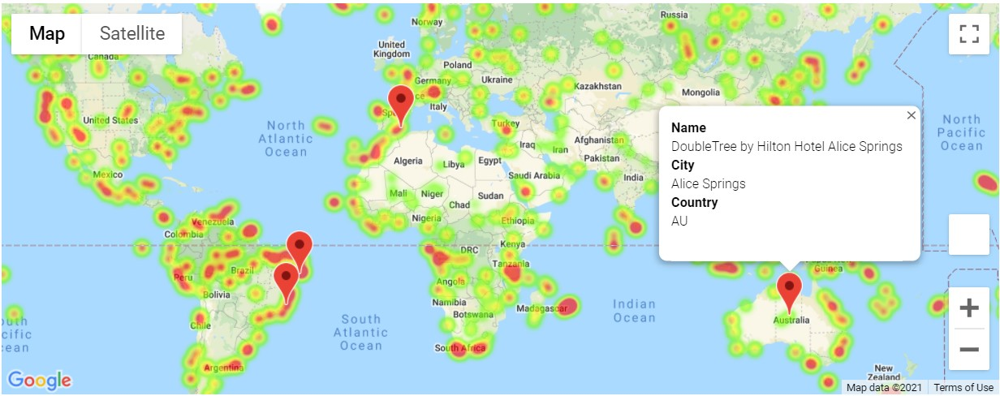

# Python API - Earth's Weather
A repository containing insights as to how a city's latitude and longitude affect its weather.

## Repository Structure
```
Python API Challenge
|__ images/             # contains heatmap with hotel pins for VacationPy
|
|__ output_data/        # contains images of WeatherPy plots and weather_data.csv
|
|
|__ .gitignore          # gitignore file
|
|__ README.md           # readme file
|
|__ VacationPy.ipynb    # contains analysis for VacationPy
|
|__ WeatherPy.ipynb     # contains analysis for WeatherPy
|
|__ api_keys.py         # contains API keys for API's used


```

## API Used:
- OpeanWeatherMap API https://openweathermap.org/api
- Google Places API https://developers.google.com/maps/documentation/places/web-service/overview#Introduction

## API Usage
- Metric units are used in OpenWeatherMap API
- All questions that have imperial units have been converted to metric and rounded to the nearest 0  

|Parameter|Imeperial|Metric| 
|-|-|-| 
|temp|Fahrenheit|Celsius| 
|wind|miles/hour|meter/sec| 
  
## API Keys
- Both API's require an API key to use
- Create an API key for each and paste into _"api_keys.py"_  
  

## Dependencies and Setup
```import matplotlib.pyplot as plt
import pandas as pd
import numpy as np
import requests
import gmaps
import os
from scipy import stats
from scipy.stats import linregress
from citipy import citipy
import time
```

## Part I - WeatherPy
- Using _np.random_uniform_ to generate a random set of latitude and longitudes across the full possible range
- Using citipy module to find the nearest city name for each coordinate
- Build a query URL and perform an API call to _OpeanWeatherMap API_ to find:
  - City name
  - Country
  - Latitude
  - Longitude
  - Date of call
  - Cloudiness (%)
  - Humidity (%)
  - Max Temperature (°C)
  - Wind Speed (m/s)
- A DataFrame is constructed as below:  
  

- The following relationships are plotted  
Temperature (°C) vs. Latitude  
  
Humidity (%) vs. Latitude  
  
Cloudiness (%) vs. Latitude  
  
Wind Speed (m/s) vs. Latitude  
  

- A linear regression analysis is completede on the following:  

Northern Hemisphere - Temperature (°C) vs. Latitude!  
  

Southern Hemisphere - Temperature (°C) vs. Latitude  
  

Northern Hemisphere - Humidity (%) vs. Latitude  


Southern Hemisphere - Humidity (%) vs. Latitude  


Northern Hemisphere - Cloudiness (%) vs. Latitude  


Southern Hemisphere - Cloudiness (%) vs. Latitude  


Northern Hemisphere - Wind Speed (m/s) vs. Latitude  


Southern Hemisphere - Wind Speed (m/s) vs. Latitude  


  
  
## Part II - VacationPy
- Using _weather_data.csv_, 
  - Create a heatmap displaying the humidity of each city
  - Narrow down to cities with:
    - Max temperature lower than 27°C and higher than 21°C
    - Wind speed less than 5m/s
    - Cloudiness of 0%
- Construct URL and query Google Place API to find nearest hotel names to narrowed down cities
- On top of the created heatmap, plot hotels with each pin containing _Hotel Name_, _City_, and _Country_.  

